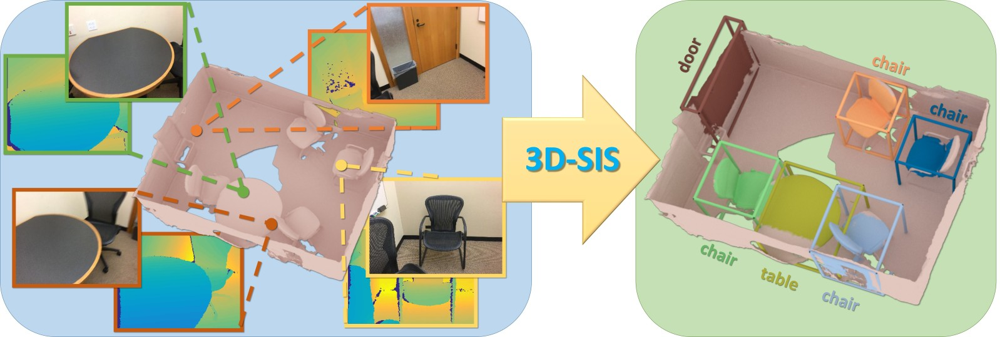
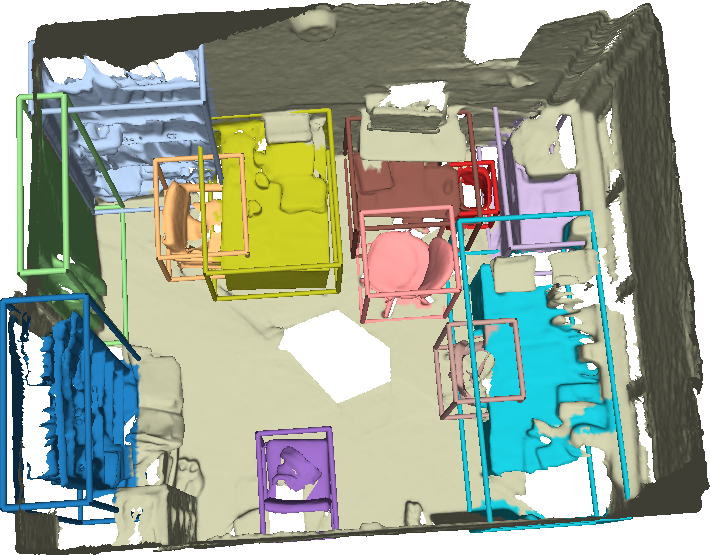
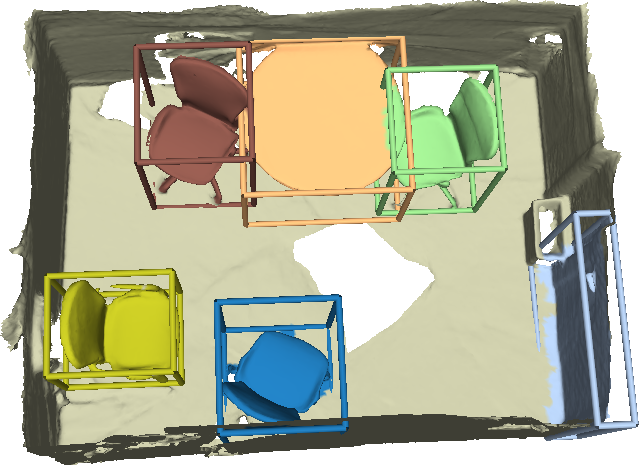

# 3D-SIS: 3D Semantic Instance Segmentation of RGB-D Scans (CVPR2019 Oral)
We present *3D-SIS*, a new framework for 3d instance segmentation.



[Download Paper (.pdf)](https://arxiv.org/pdf/1812.07003.pdf)

[See Youtube Video](https://www.youtube.com/watch?v=IH9rNLD1-JE)

## Data Generation
Data generation code is detailed in [datagen](https://github.com/Sekunde/3D-SIS/tree/master/datagen).

### Download Traininig Data

The training data we generated is provided.
* [ScanNet Training Chunks (70GB)](http://kaldir.vc.in.tum.de/3dsis/scannet_train_chunks.zip)
* [ScanNet Training Images (13GB)](http://kaldir.vc.in.tum.de/3dsis/scannet_train_images.zip)

### Download Validation and Test Data
We provide the test and validation data (.scene and images) as examples. The detailed format of data, see [saveChunkToFile](https://github.com/Sekunde/3D-SIS/blob/master/datagen/SceneSampler/main.cpp#L348-L415). Download the
* [ScanNetV2 Test Data (100 scenes) (801MB)](http://kaldir.vc.in.tum.de/3dsis/scannet_benchmark_test_data.zip)
* [ScanNetV2 Validation Data (95 scenes) (746MB)](http://kaldir.vc.in.tum.de/3dsis/scannet_benchmark_validation_data.zip)
* [ScanNetV2 Validation Data (312 scenes) (3664MB)](http://kaldir.vc.in.tum.de/3dsis/scannetv2_test_data.zip)
* [SUNCG Test Data (1355MB)](http://kaldir.vc.in.tum.de/3dsis/suncg_test_data.zip)

## Installation
Install dependencies ```pip install -r requirements.txt```
Note: You may need to rebuild `NMS` and `RoIPooling` layer by running `python build.py` under `lib/layer_utils/nms` and `lib/layer_utils/roi_pooling` separately. The rest dependencies can be found in [requirements.txt](https://github.com/Sekunde/3D-SIS/blob/master/requirements.txt). 

The code is tested on Ubuntu 16.04 with CUDA8.0 and GTX1080Ti. If you encounter any CUDA/GPU issues, change the `MAX_VOLUME` and `MAX_IMAGE` in `lib/utils/config.py` to 0. This will enable inference on CPU.
### Folder Structure
Expected file structure:

```
   |--code/
      |--main.py
      |--datagen
          ⋮
   |--checkpoints/
      |--ScanNet
         |--benchmark (the same name as the configuration file without .yml)
            |--checkpoints (download checkpoints (.pkl and .pth) into this folder)
         |--rpn_class_mask_5 (the same name as the configuration file without .yml)
            |--checkpoints (download checkpoints (.pkl and .pth) into this folder)
              ⋮
      |--SUNCG
   |--results/        (store the inference results)
      |--ScanNet
         |--benchmark (the same name as the configuration file)
            |--test   (TEST_SAVE_DIR, see Section Configuration files)
            |--val  
      |--SUNCG
   ```


### Demo Code
You can run our demo code by `bash example.sh`, the visualization result is stored in `example_result/visualization`.

### Checkpoints
We provide checkpoints for inference on test data. Download the
* [ScanNet Benchmark Checkpoint (21MB)](http://kaldir.vc.in.tum.de/3dsis/scannet_benchmark_checkpoint.zip)
* [ScanNet Checkpoint (v2 annotations, v1 split: train on 1045 scenes, test on 312 scenes) (21MB)](http://kaldir.vc.in.tum.de/3dsis/scannetv2_checkpoint.zip)
* [SUNCG Checkpoint (20MB)](http://kaldir.vc.in.tum.de/3dsis/suncg_checkpoint.zip)
* [ScanNet Enet Checkpoint (1.2MB)](http://kaldir.vc.in.tum.de/3dsis/scannet_enet_checkpoint.zip)
* [SUNCG Enet Checkpoint (1.2MB)](http://kaldir.vc.in.tum.de/3dsis/suncg_enet_checkpoint.zip)

### Configuration Files
Configuration files are stored in `experiments/cfgs/` folder. You can alter your own setup in the configuration file. The following several parameters need to be changed normally. See [more details](https://github.com/Sekunde/3D-SIS/tree/master/experiments/cfgs).

```yaml
#----------- Filelists--------------
# filelist of training chunks
TRAIN_FILELIST: experiments/filelists/ScanNet/v2/train.txt
# filelist of validation chunks
VAL_FILELIST: experiments/filelists/ScanNet/v2/val_chunk.txt
# filelist of subset of training chunks, used to check for overfitting degree
TRAINVAL_FILELIST: experiments/filelists/ScanNet/v2/trainval.txt
# filelist of test scenes
TEST_FILELIST: experiments/filelists/ScanNet/v2/test.txt

#----------- Result folder -----------
# where to store the validation results (chunks)
VAL_SAVE_DIR: ../results/ScanNet/benchmark/val
# where to store the test results (scenes)
TEST_SAVE_DIR: ../results/ScanNet/benchmark/test

# ----------- Backbone -------------
# load checkpoint for backbone
LOAD_BACKBONE: True
# use the backbone
USE_BACKBONE: True
# fix the backbone weights or not
FIX_BACKBONE: False
# load checkpoint for RPN
LOAD_RPN: True
# use RPN, if false, use groundtruth bbox
USE_RPN: True
# fix weights of RPN network
FIX_RPN: False
# load checkpoint for classification network
LOAD_CLASS: True
# use classification network, if not, use the groundtruth class labels
USE_CLASS: True
# fix the classification network weights or not
FIX_CLASS: False
# use the second backbone for mask or not
USE_MASK: True

#-------------Enet---------------------
# use color images or not
USE_IMAGES: True
# where is the image folder
BASE_IMAGE_PATH: '/mnt/local_datasets/ScanNet/frames_square'
# where is the enet pretrained network
PRETRAINED_ENET_PATH: /mnt/local_datasets/ScanNet/scannetv2_enet.pth

```
(Hint: You can change the `MAX_VOLUME` and `MAX_IMAGE` in `lib/utils/config.py` to smaller number, if your GPU does not have enough memory. This will enable inference on CPU)

### Inference on ScanNetV2
1. Download [ScanNet Checkpoint (v2 annotations, v1 split)](#checkpoints) to corresponding folder, see [Folder Structure](#folder-structure)
2. Download [ScanNet Enet Checkpoint](#checkpoints) and [ScanNetV2 Validation Data (312 scenes)](#download-test-data) with following structure.
```
   |--scannetv2_validation_data/
      |--scenes
      |--images_square (notice: do not change the name of this folder, since it is hardcoded in [Dataset](https://github.com/Sekunde/3D-SIS/blob/master/lib/datasets/dataset.py#L144-L149)
```
3. Modify the `PRETRAINED_ENET_PATH` to enet checkpoint, `BASE_IMAGE_PATH` to `scannetv2_validation_data/images` in the configuration file `experiments/cfgs/ScanNet/rpn_class_mask_5.yml`.
4. Change the text file `experiments/filelists/ScanNet/v1/test.txt` pointing to `scannetv2_validation_data/scenes/*.scene`.
5. Run ```python main.py --cfg ScanNet/rpn_class_mask_5 --mode test --step 805146 --gpu 0``` (predictions will be stored in `TEST_SAVE_DIR`)
6. Visualize the results, by run `python tools/visualization.py --path TEST_SAVE_DIR --mode results` (visualizations will be stored in `TEST_SAVE_DIR` as *.ply* files)

### ScanNet Benchmark
1. Download [ScanNet Benchmark Checkpoint](#checkpoints) to corresponding folder, see [Folder Structure](#folder-structure)
2. Download [ScanNet Enet Checkpoint](#checkpoints) and [ScanNetV2 Validation Data (95 scenes)](#download-test-data) with following structure.
```
   |--scannet_benchmark_validation_data/
      |--scenes
      |--images_square (notice: do not change the name of this folder, since it is hardcoded in [Dataset](https://github.com/Sekunde/3D-SIS/blob/master/lib/datasets/dataset.py#L144-L149)
      |--gt_insts
      |--scans
```
3. Modify the `PRETRAINED_ENET_PATH` to enet checkpoint, `BASE_IMAGE_PATH` to `scannet_benchmark_validation_data/images` in the configuration file `experiments/cfgs/ScanNet/benchmark.yml`.
4. Change the text file `experiments/filelists/ScanNet/v2/val_scene.txt` pointing to `scannet_benchmark_validation_data/scenes/*.scene`.
5. Run ```python main.py --cfg ScanNet/benchmark --mode benchmark --step 1205541 --gpu 0``` (predictions will be stored in `TEST_SAVE_DIR`)
6. Transferring the predicted results to [ScanNet Benchmark Format](http://kaldir.vc.in.tum.de/scannet_benchmark/documentation#format-instance3d):
```
python tools/scannet_benchmark/vox2mesh.py --pred_dir TEST_SAVE_DIR --output_dir ./benchmark_result --scan_path scannet_benchmark_validation_data/scans --frames scannet_benchmark_validation_data/images
```
7. Visualize the results, by run `python tools/scannet_benchmark/visualize_benchmark.py --output_dir ./benchmark_vis --result_dir ./benchmark_result --scan_path scannet_benchmark_validation_data/scans`. Visualiations are in pointcloud as following:

<p align=center> &nbsp;&nbsp;&nbsp;&nbsp;&nbsp;&nbsp;&nbsp;&nbsp;&nbsp;&nbsp;&nbsp;&nbsp;

8. Evaluate the results, by run `python tools/scannet_benchmark/evaluate_semantic_instance.py --pred_path ./benchmark_result --gt_path scannet_benchmark_validation_data/gt_insts --output_file ./benchmark_result.txt`

  (Hint: You can also submit to the [ScanNet Benchmark](http://kaldir.vc.in.tum.de/scannet_benchmark/semantic_instance_3d) using [ScanNet Benchmark Test Data](#download-test-data), but you need to remap the [labelset](http://kaldir.vc.in.tum.de/scannet_benchmark/documentation#label-set) after step.7 by running `python tools/scannet_benchmark/proj_label.py --pred_path benchmark_result`)

### Inference on SUNCG dataset
1. Download the [SUNCG Checkpoint](#checkpoints) to corresponding folder, see [Folder Structure](#folder-structure)
2. Download the [SUNCG Enet Checkpoint](#checkpoints) and [SUNCG Test Data](#download-test-data) with following structure.
```
   |--suncg_test_data/
      |--scenes
      |--images_augmented (notice: do not change the name of this folder, since it is hardcoded in [Dataset](https://github.com/Sekunde/3D-SIS/blob/master/lib/datasets/dataset.py#L144-L149)
```
3. Modify the `PRETRAINED_ENET_PATH` to enet checkpoint, `BASE_IMAGE_PATH` to `suncg_test_data/images` in the configuration file `experiments/cfgs/SUNCG/rpn_class_mask_5.yml`.
4. Change the text file `experiments/filelists/suncg/nonaug/test.txt` pointing to `suncg_test_data/scenes/*.scene`.
5. Run ```python main.py --cfg SUNCG/rpn_class_mask_5 --mode test --step 956472 --gpu 0``` (predictions will be stored in `TEST_SAVE_DIR`)
6. Visualize the results, by run `python tools/visualization.py --path TEST_SAVE_DIR --mode results` (visualizations will be stored in `TEST_SAVE_DIR` as *.ply* files)


### Train your own model
1. Generate training data, see [Training Data](#download-traininig-data) or [Data Generation](#data-generation)
2. Generate the filelists pointing to your `.chunk` and `.scene` data.
3. Copy `experiments/cfgs/ScanNet/benchmark.yml` to `experiments/cfgs/ScanNet/your_own.yml`
4. Setup `Filelists`, `Result folder` and `Enet` parts correspondingly in `your_own.yml`.
5. Train the RPN and classification network. Setup the following parameters in `your_own.yml` and run `python main.py --cfg ScanNet/your_own --epoch 10 --gpu 0` for `200k` steps.
  ```yaml
LOAD_BACKBONE: True
USE_BACKBONE: True
FIX_BACKBONE: False
LOAD_RPN: True
USE_RPN: True
FIX_RPN: False
LOAD_CLASS: True
USE_CLASS: True
FIX_CLASS: False
USE_MASK: False
```
6. Train the second backbone for mask prediction. Setup the following parameters in `your_own.yml` and run `python main.py --cfg ScanNet/you_own --epoch 10 --gpu 0` for another `200k` steps.
  ```yaml
LOAD_BACKBONE: True
USE_BACKBONE: True
FIX_BACKBONE: True
LOAD_RPN: True
USE_RPN: True
FIX_RPN: True
LOAD_CLASS: True
USE_CLASS: True
FIX_CLASS: True
USE_MASK: True
```

## Citation
If you use this code please cite:

```
@inproceedings{hou2019sis,
  title={3D-SIS: 3D Semantic Instance Segmentation of RGB-D Scans},
  author={Hou, Ji and Dai, Angela and Nie{\ss}ner, Matthias},
	booktitle = {Proc. Computer Vision and Pattern Recognition (CVPR), IEEE},
	year={2019}
}
```

## License
[3D-SIS is licensed under a Creative Commons Attribution-NonCommercial-ShareAlike 3.0 Unported License](https://github.com/Sekunde/3D-SIS/blob/master/LICENSE).
